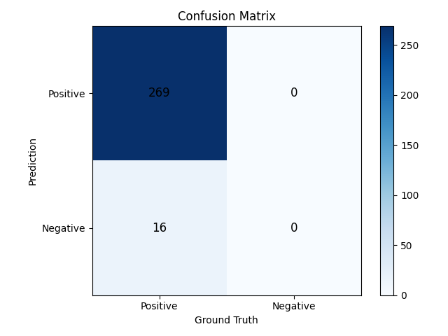

# Face Detection Evaluation

MTMN là mô hình phát hiện khuôn mặt nhanh, chính xác và nhẹ, phù hợp cho hệ thống nhúng, với các tham
số cấu hình linh hoạt cho nhiều trường hợp sử dụng. Mô hình đạt độ chính xác và độ bao phủ cao trên tập kiểm tra, thời gian suy luận hiệu quả.

> Tham khảo source tại: [esp-face](https://github.com/yuricsource/esp-face/tree/master/face_detection)

## Tổng Quan Mô Hình

**Mô hình:** MTMN (Multi-task Cascaded Convolutional Networks với MobileNetV2)
**Mục đích:** Phát hiện khuôn mặt người nhẹ, tối ưu cho thiết bị nhúng.
**Đầu vào:** Ảnh RGB 24-bit.

### Kiến Trúc

MTMN gồm ba giai đoạn chính:
- **P-Net (Proposal Network):** Tạo ra các hộp giới hạn ứng viên.
- **R-Net (Refine Network):** Lọc và tinh chỉnh các hộp giới hạn.
- **O-Net (Output Network):** Xuất ra hộp giới hạn cuối cùng, điểm tin cậy và 5 điểm đặc trưng khuôn mặt.

### API

```c
box_array_t *face_detect(dl_matrix3du_t *image_matrix, mtmn_config_t *config);
```
- **Đầu vào:** `image_matrix` (dữ liệu ảnh), `config` (tham số phát hiện)
- **Đầu ra:** `box_array_t` (hộp giới hạn, điểm tin cậy, landmark)

## Kết Quả Đánh Giá

- **Tập test:** 285 ảnh, chụp từ camera ESP32-CAM.

| Chỉ số      | Giá trị   |
|-------------|----------|
| Precision   | 1.0000   |
| Recall      | 0.9439   |
| TP          | 269      |
| FP          | 0        |
| FN          | 16       |
| TN          | 0        |


