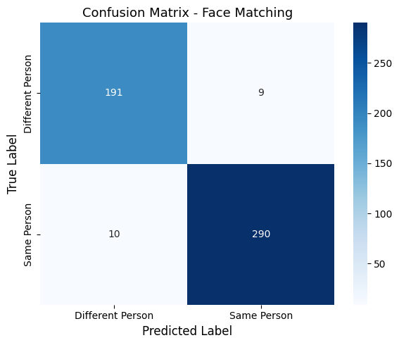

# Đánh giá Mô hình Face Matching

> Mô hình này được evalute trên tập dataset [Labelled Faces in the Wild (LFW) Dataset](https://www.kaggle.com/datasets/jessicali9530/lfw-dataset/data)

## Thông tin Dataset
- **Tổng mẫu**: 480
- **Cặp đồng nhất**: 150 (31.2%)
- **Cặp khác nhau**: 330 (68.8%)

## Thông tin Mô hình
- **Model**: VGGFace2 (InceptionResnetV1)
- **Ngưỡng tối ưu**: 0.3900

## Kết quả Đánh giá
| Metric | Giá trị | Phần trăm |
|--------|---------|-----------|
| Accuracy | 0.9792 | 97.92% |
| Precision | 0.9605 | 96.05% |
| Recall | 0.9733 | 97.33% |
| F1-score | 0.9669 | 96.69% |
| AUC | 0.9972 | 99.72% |

> **Kết luận**: Mô hình đạt hiệu suất rất cao với độ chính xác 97.92% và AUC 99.72%, chứng tỏ khả năng phân biệt tốt giữa các cặp khuôn mặt đồng nhất và khác nhau. Đặc biệt, chỉ số Recall cao (97.33%) cho thấy mô hình hiếm khi bỏ sót các trường hợp trùng khớp thực sự.
