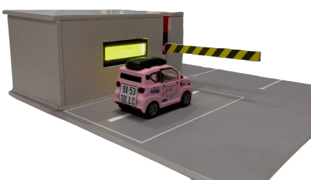
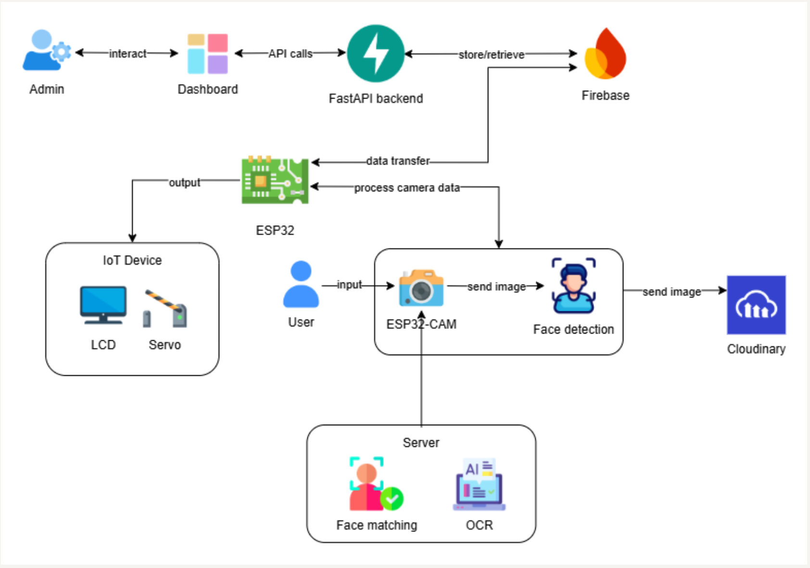

# Smart Parking System – AIoT-based

## Overview
Smart Parking System is an AIoT-based solution that automates parking operations using face recognition, license plate detection, and real-time slot monitoring.  
The project targets small-scale lots (5–10 slots) but can be scaled for real deployments.

## Key Features
- Face recognition (≥90% accuracy in daylight)  
- License plate recognition via API  
- Real-time slot status updates  
- Automatic barrier control using servo motor  
- LCD display for entry/exit information  
- Web dashboard (ReactJS + Firebase) with history, images, and statistics

## System Architecture

### Layers
1. **Input Layer:** ESP32-CAM for image capture and face detection (MTMN).  
2. **Processing Layer:** ESP32 DevKit with FastAPI backend; integrates FaceNet and Plate Recognizer APIs, stores data in Firebase.  
3. **Output Layer:** Servo barrier, LCD 16×2 display, and ReactJS dashboard.

## Hardware & Software
**Hardware:** ESP32-CAM, ESP32 DevKit, LCD 16×2 (I2C), Servo SG90, 5V–3A power supply.  
**Software:** Arduino IDE, FastAPI, Firebase, Cloudinary, ReactJS, FaceNet, Plate Recognizer API.

## Testing & Evaluation
- Face accuracy: ≥90% (daytime)  
- Plate OCR: API-standard accuracy  
- Entry/exit processing: ≤15s  
- Slot update delay: ≤5s

## Team
| Member | Role | Responsibility |
|---------|------|----------------|
| Cao Uyển Nhi | Team Lead, AI | AI model integration |
| Trần Thị Cát Tường | Hardware | ESP32 control, servo, cloud |
| Lưu Thanh Thuý | IoT Developer | ESP32-CAM, communication |
| Võ Lê Việt Tú | Backend & Frontend | API, dashboard UI |

## Future Work
- Improve low-light recognition  
- Add ultrasonic sensors for slot detection  
- Mobile app for booking and payment  