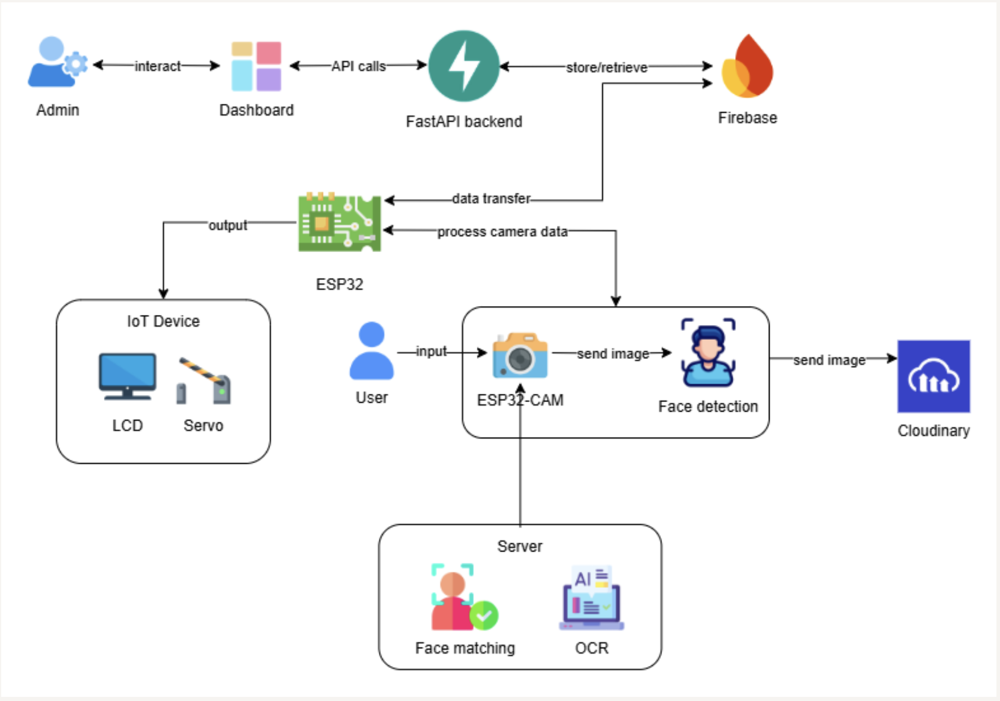

# Thiết kế hệ thống

## Kiến trúc phần mềm

Hệ thống được thiết kế dựa trên mô hình phân tầng, bao gồm các thành phần chính: tầng thiết bị đầu vào, tầng xử lý trung tâm, và tầng điều khiển - phản hồi.

### Thiết bị đầu vào (Input Layer)

- Người dùng tương tác trực tiếp với hệ thống thông qua camera.
- Camera OV2640 tích hợp trên ESP32-CAM
    - Chụp ảnh biển số và khuôn mặt tại lối vào/ra.
    - Chạy mô hình MTMN (ESP-FACE) để phát hiện khuôn mặt và trả về bounding box.
    - Gửi ảnh hợp lệ lên Cloudinary và URL ảnh lên Firebase qua REST API.

### Tầng xử lý trung tâm (Processing Layer)

Tầng này chịu trách nhiệm xử lý dữ liệu từ thiết bị đầu vào, thực hiện các tác vụ trí tuệ nhân tạo và điều phối hoạt động của hệ thống. Server Backend (FastAPI) chịu trách nhiệm:

- Lấy URL ảnh từ Firebase.
- Nhận diện khuôn mặt: mô hình FaceNet trích xuất embedding và so khớp với cơ sở dữ liệu.
- Nhận dạng biển số: Plate Recognizer API sẽ nhận request là hình ảnh chứa biển số và trả về chuỗi ký tự.
- Ghi kết quả nhận diện (biển số, trạng thái hợp lệ, thời gian) vào Firebase.

### Thiết bị điều khiển - phản hồi (Output Layer)

**Thiết bị IoT** gồm:

- **Servo (Barrier):** mở/đóng rào chắn tự động.
- **LCD Display:** hiển thị thông tin trực quan (số ô trống, lỗi, trạng thái...).

**Dashboard (giao diện quản trị cho Admin):**

- Kết nối Firebase để lấy dữ liệu thời gian thực.
- Hiển thị danh sách lượt vào/ra, trạng thái slot, thống kê lịch sử.
- Cho phép truy xuất dữ liệu và giám sát hệ thống từ xa.
