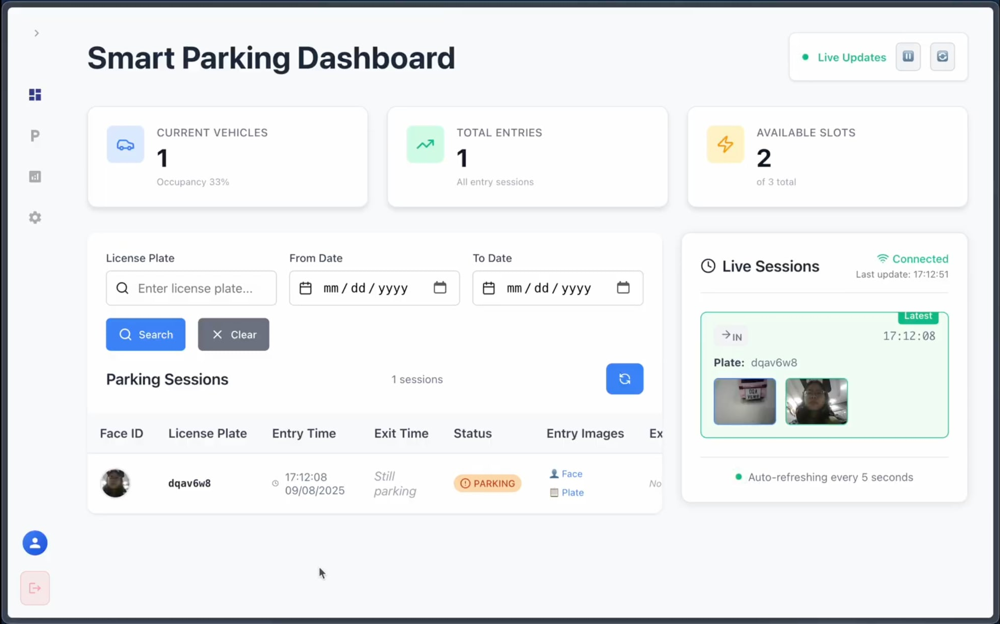

# Kiểm thử và Đánh giá

## Mục tiêu kiểm thử

Quá trình kiểm thử được thực hiện nhằm:

- `O-01`: Đánh giá độ chính xác nhận diện biển số xe và khuôn mặt.
- `O-02`: Đo thời gian xử lý và khả năng cập nhật trạng thái chỗ đỗ.
- `O-03`: Xác nhận độ hoàn thiện chức năng quản lý bãi xe.

## Phương pháp kiểm thử

- **Đánh giá mô-đun (Module-level Evaluation)**: Sử dụng tập dữ liệu test để tính độ chính xác, precision, recall cho từng mô hình AI.

- **Đo thời gian xử lý thực tế**: Ghi nhận thời gian trung bình từ khi xe vào vùng nhận diện đến khi barrier mở (session).

## Kết quả đánh giá

### Các mô hình AI
| Mô-đun AI | Nguồn Dataset | Kích thước test | Precision | Recall | Accuracy | F1-score | Ghi chú |
|-----------|---------------|-----------------|-----------|--------|----------|----------|---------|
| **Face Detection (MTMN)**   | 285 ảnh từ ESP32-CAM (thu thực tế)                                                                                                     | 285 ảnh                                  | 1.0000    | 0.9439 | —        | —        | TP=269, FP=0, FN=16        |
| **Face Matching (FaceNet)** | [LFW Dataset](https://www.kaggle.com/datasets/jessicali9530/lfw-dataset/data)                                                          | 500 cặp (300 cùng người, 200 khác người) | 0.970     | 0.967  | 0.962    | 0.968    | Ngưỡng tối ưu ≈ 0.576      |
| **OCR Biển số xe**          | [Vietnam License Plate Dataset – Roboflow](https://universe.roboflow.com/tran-ngoc-xuan-tin-k15-hcm-dpuid/vietnam-license-plate-h8t3n) | 101 ảnh                                  | —         | —      | 1.000    | —        | Nhận diện đúng 101/101 ảnh |

### Thời gian xử lý

- Thời gian xử lý trung bình: $\approx$ 12 giây cho một session xe vào hoặc ra (từ lúc phát hiện đến khi barrier mở).

## Đánh giá chung

- `O-01`: Các mô-đun AI đạt độ chính xác cao:
    - Face Detection: Precision 1.0, Recall $\approx$ 94%
    - Face Matching (LFW dataset): Accuracy $\approx$ 96.2%
    - OCR Biển số (Vietnam License Plate Dataset): Accuracy 100%

- `O-02`: Thời gian xử lý trung bình 12s.

- `O-03`: Hệ thống có đầy đủ chức năng chính (nhận diện, ghi log, lưu cloud, dashboard, điều khiển barrier).

{width=80%}

\pagebreak
